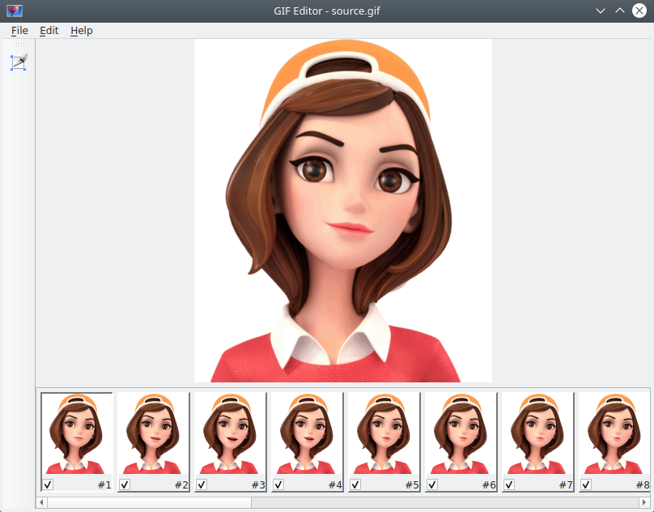
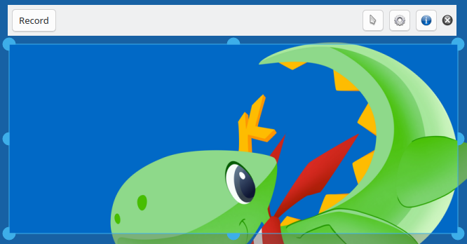

# About

`GIF` editor and recorder for `Windows` and `Linux/X11`.

I consider this tools as a first aid for QA specialists. For UI bug reports it's
an essential to provide good UI example what happens, and with GIF recorder
you can easily record a problem, with mouse clicks, key presses, I think
this is very helpful for a developer to see a real record of a problem in bug report.

In editor QA can add a text (even making an animation is possible) or highlight something
important with rectangle, it's a very easy tool. When editing tool in editor will be
chosen user will see a description text how to use this or that tool, these messages can
be turned off in settings dialogue.

GIF recorder produces not the best quantization for 256 colors in GIF, but this tool
doesn't skip frames, and everything is seen, minor issues in quantization are seen only
on shades, or when difference between colors is not so significant. I use these tools for
my own needs, and believe me the quality is very good for QA tasks. And produced output
files are very small by size, as this is a GIF format, what it was designed.

Try it for yourself. Enjoy.

# Example

You can see at recorded GIFs with these tools [here](https://igormironchik.github.io/markdown-tools/).

# Plans

When `KDE` will be fully switched to `Wayland` and refused from `X11` I will
look what can be done for `Wayland`. At this time on `Linux` only `X11` will be
supported.

# License

```cpp
/*
    SPDX-FileCopyrightText: 2026 Igor Mironchik <igor.mironchik@gmail.com>
    SPDX-License-Identifier: GPL-3.0-or-later
*/
```

# Screenshots

|  |  |
| --- | --- |


# Known issues

* `Wayland` is not supported in recorder.
