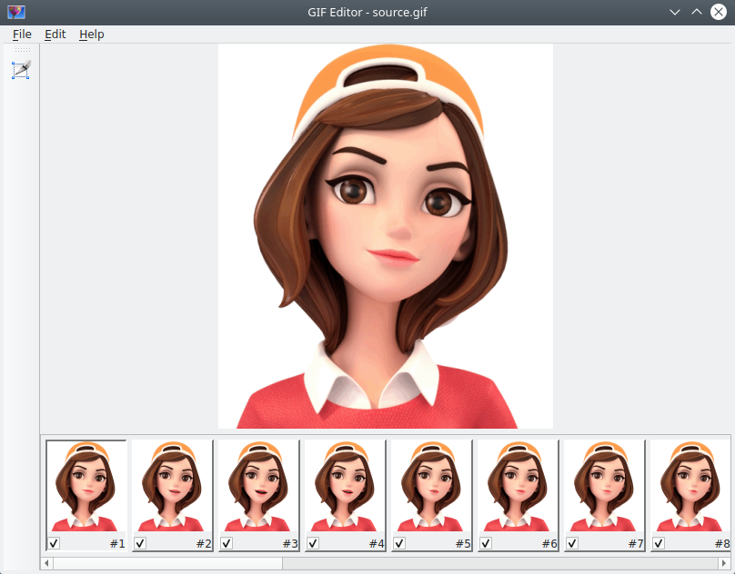
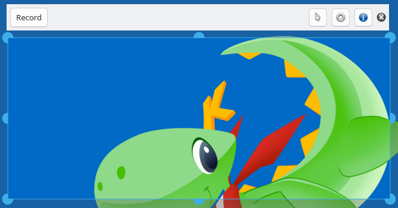

# About

`GIF` editor and recorder for `Windows` and `Linux/X11`.

I consider this tools as a first aid for QA specialists. For UI bug reports it's
an essential to provide good UI example what happens, and with GIF recorder
you can easily record a problem, with mouse clicks, key presses, I think
this is very helpful for a developer to see a real record of a problem in bug report.

In editor QA can add a text (even making an animation is possible) or highlight something
important with rectangle, draw arrow, it's a very easy tool. When editing tool in editor will be
chosen user will see a description text how to use this or that tool, these messages can
be turned off in settings dialogue. In editor GIF player is implemented, with possibility to
pause a GIF, that can be very helpful for developers to see what QA highlighted with
a rectangle or arrow. Really-really easy and helpful tool.

GIF recorder produces not the best quantization for 256 colors in GIF, but this tool
doesn't skip frames, and everything is seen, minor issues in quantization are seen only
on shades, or when difference between colors is not so significant. I use these tools for
my own needs, and believe me the quality is very good for QA tasks. And produced output
files are very small by size, as this is a GIF format, what it was designed.

Try it for yourself. Enjoy.

# Example

You can see at recorded GIFs with these tools [here](https://igormironchik.github.io/markdown-tools/).

# Plans

When `KDE` will be fully switched to `Wayland` and refused from `X11` I will
look what can be done for `Wayland`. At this time on `Linux` only `X11` will be
supported.

# License

```cpp
/*
    SPDX-FileCopyrightText: 2026 Igor Mironchik <igor.mironchik@gmail.com>
    SPDX-License-Identifier: GPL-3.0-or-later
*/
```

# Screenshots

|  |  |
| --- | --- |

# Getting from repository

After cloning update git submodules with:

```bash
git submodule update --init --recursive
```

# Building

In dependencies is Qt 6 only. Use CMake or QtCreator to build this project in usual fashion.

# Known issues

* `Wayland` is not supported in recorder.

* Non-primary monitors do not allow adjust recording area, unable to move recording area
from primary screen to secondary.
[Corresponding issue](https://github.com/igormironchik/gif-tools/issues/3).
I can't work on this problem because of hardware problems (I don't have second monitor, only
one laptop). This is a good first issue to start, pool request is welcome. For wished to do this -
short introduction in a few words - GIF recorder is a full screen application, and recording area
is just a painting on full-screen semi-transparent widget, to solve this task entire screens
available in the system should be occupied by main widget (this is a half of the solution). Second
thing to check is how Qt will do screen grabbing from two or more screens at the same time,
this should be tested on a multi-monitor system (keep in mind that on Linux tests should be done
on X11, Wayland won't work now, support for Wayland will be in progress when KDE will bump version
to 6.8.0 and drop X11 support).
